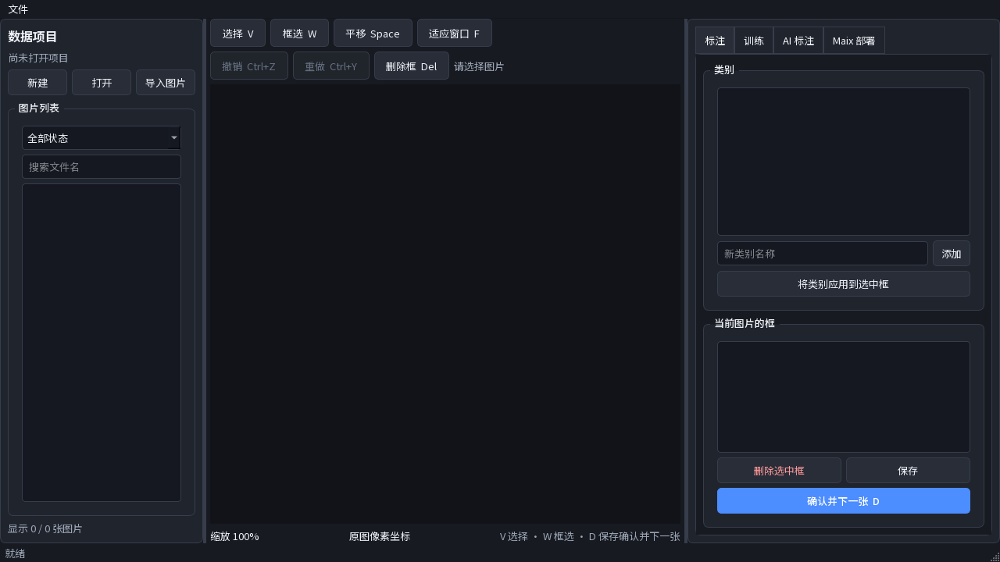
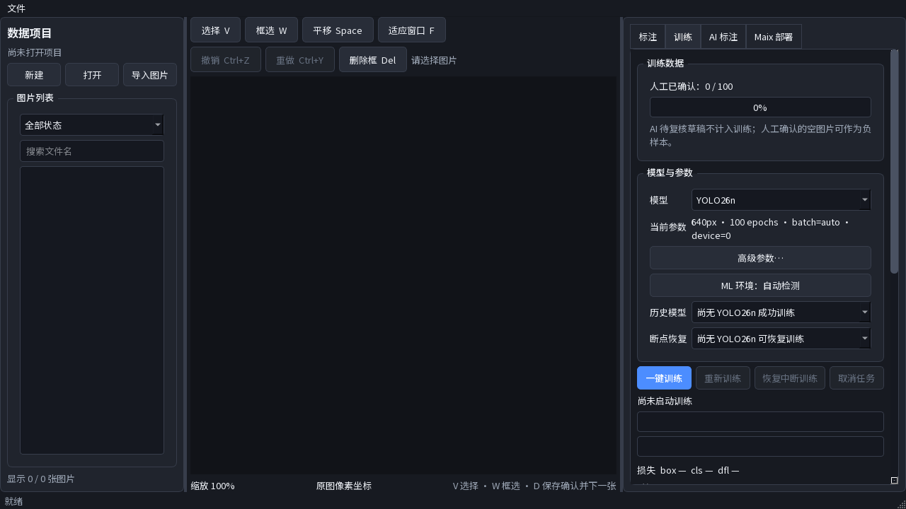

# AI-Biaozhu：本地 YOLO 标注、训练与 MaixCAM 部署工作台

> 当前维护版：**0.2.3**  
> 平台：64 位 Windows 10 1809（build 17763）或更高版本  
> 任务类型：矩形框目标检测（Detection）

AI-Biaozhu 是一款面向 Windows 的本地视觉数据工作台。它把图片导入、人工框选、
训练成员管理、YOLO 训练、AI 草稿复核，以及 MaixCAM-Pro / MaixCAM2 部署文件生成
集中在同一个桌面程序中。

它的核心目标不是让 AI 直接替代人工，而是建立一个可追溯的闭环：先用少量高质量
人工标注训练初始模型，再让模型为剩余图片生成草稿，最后由人工复核后继续训练。

```text
图片或 MaixHub / Pascal VOC 数据
              ↓
         人工矩形框标注
              ↓
      人工确认（verified）
              ↓
         不可变训练快照
              ↓
       YOLO 训练与指标查看
              ↓
       AI 草稿（draft）复核
              ↓
   继续训练 / YOLO 导出 / Maix 部署
```

第一次使用请阅读：[新手完整操作与 Maix 部署指南](BEGINNER_GUIDE_CN.md)。

## 界面预览





## 适合哪些用户

- 需要自行制作 YOLO 目标检测数据集的个人开发者或小团队；
- 希望图片、标注数据库和模型默认保存在本机的用户；
- 需要通过 NVIDIA GPU 在 Windows 上训练目标检测模型的用户；
- 希望用“人工种子数据 → AI 草稿 → 人工复核 → 再训练”减少重复画框的人；
- 需要将模型转换为 MaixCAM-Pro 或 MaixCAM2 可运行格式的开发者；
- 重视训练快照、数据库备份、文件哈希和实验可追溯性的项目。

如果主要需求是多人浏览器实时协作、实例分割、旋转框、姿态估计或任意第三方模型
导入，本项目目前并不合适。

## 主要功能

### 1. 本地项目与图片管理

- 新建或打开本地项目；
- 支持 JPG、JPEG、PNG、BMP、WebP；
- 导入时把图片复制进项目，避免原始路径变化导致项目失效；
- 使用 SHA-256 检测重复图片；
- 统一 EXIF 方向；
- 跳过损坏或不支持的图片并生成导入报告；
- 支持图片筛选、Ctrl/Shift 多选、范围选择；
- 支持批量加入训练、移出训练和安全删除。

项目不是“只保存图片路径”的索引。导入图片、训练快照、checkpoint 和部署中间文件
都可能占用较多空间，建议把正式项目建立在容量充足的磁盘，并定期备份整个项目目录。

### 2. MaixHub / Pascal VOC 混合导入

除普通图片外，软件可以读取包含 `images/`、`annotations/` 和 XML 文件的
MaixHub / Pascal VOC 数据集，并区分：

- 有框 XML：人工已确认的正样本；
- 空 XML：人工已确认的负样本；
- 没有 XML：尚未复核的图片。

合并到已有项目时，新数据不会静默覆盖人工结果。未确认图片或纯 AI 草稿可以安全
升级；人工确认、人工修改或混合标注的重复图片会保留，并进入冲突报告。

### 3. 矩形框标注工作台

- 新建、选择、移动和八方向缩放矩形框；
- 修改选中框的类别；
- 重叠框循环选择；
- 图片缩放、适应窗口和平移；
- 撤销、重做和本次编辑全部撤销；
- 完整显示、仅显示框、全部隐藏三种显示模式；
- 高度重叠框和贴近图像边缘框的质量提醒；
- 批量清空标注前创建数据库备份。

常用快捷键：

| 快捷键 | 功能 |
|---|---|
| `W` | 矩形框工具 |
| `V` | 选择工具 |
| `A` | 上一张图片 |
| `S` | 删除当前选中的框 |
| `D` | 保存、人工确认并进入下一张 |
| `Ctrl+Z` / `Ctrl+Y` | 撤销 / 重做 |
| `Ctrl+Alt+Z` | 全部撤销当前图片本次打开后的修改 |
| `Ctrl+Shift+Delete` | 打开批量“删除所有标记” |
| `F` | 适应窗口 |
| 按住 `Space` | 临时平移画布 |

没有框的图片也可以按 `D` 确认为明确负样本。

### 4. 人工真值与 AI 草稿严格分离

每张图片有三种核心状态：

| 状态 | 含义 | 是否进入训练 |
|---|---|---|
| `unreviewed` | 尚未经过人工确认 | 否 |
| `draft` | AI 建议或尚未确认的修改 | 否 |
| `verified` | 用户明确按 `D` 完成人工确认 | 是，但还必须处于“加入训练”状态 |

AI 结果不会覆盖人工确认图片。图片修订版本、AI 导入记录和唯一索引还用于防止过期
结果覆盖新修改，以及中断恢复时反复叠加相同预测。

### 5. 类别与训练成员管理

类别支持：

- 修改界面显示名称；
- 完整重命名正式类别名；
- 保留旧名称作为 VOC 导入别名；
- 删除全项目零实例类别。

完整重命名和删除空类别前会备份数据库。只有整个项目中框数量为 0、且不是最后一个
类别时，才允许删除类别。

图片是否进入训练由两个条件共同决定：

1. 图片已经“加入训练”；
2. 图片已经人工确认。

仅仅画了框但没有按 `D`，或仅仅选入训练但仍是 AI 草稿，都不会进入训练快照。

## 支持的模型

| 模型 | 预训练权重 | 后端 |
|---|---|---|
| YOLOv5n | `yolov5n.pt` | 传统 YOLOv5 v7.0 |
| YOLOv5s | `yolov5s.pt` | 传统 YOLOv5 v7.0 |
| YOLOv8n | `yolov8n.pt` | Ultralytics |
| YOLOv8s | `yolov8s.pt` | Ultralytics |
| YOLO11n | `yolo11n.pt` | Ultralytics |
| YOLO11s | `yolo11s.pt` | Ultralytics |
| YOLO26n | `yolo26n.pt` | Ultralytics |
| YOLO26s | `yolo26s.pt` | Ultralytics |

默认模型为 YOLO26n。不同模型首次使用时可能需要联网准备官方权重。仓库中的
`bundled_models/yolo26s.pt` 来自锁文件记录的
[Ultralytics v8.4.0 资产](https://github.com/ultralytics/assets/releases/download/v8.4.0/yolo26s.pt)，
长度为 20,422,725 字节，SHA-256 为
`646f8bc3fe0a656803d95c294f7852321748cb29d13466a1af8862e2db384a1b`；模型和权重
仍受其提供方许可证约束。

注意：仓库较早的 `THIRD_PARTY_NOTICES.md` 仍保留“模型权重不预装”的旧描述，与当前
0.2.3 源码快照不一致。当前仓库实际包含上述单个 YOLO26s 种子权重；其他型号仍按锁定
来源准备。重新分发前应以实际文件清单、锁文件和模型提供方的当前许可为准。

## 训练规则与能力

第一次成功训练前，必须同时满足：

- 至少 100 张不同的“已加入训练 + 人工已确认”图片；
- 至少有一张带框正样本；
- 每个启用类别至少有一个实例。

已确认的空负样本可以计入 100 张；AI 草稿不能计入。项目已有一次成功训练后，100
张不再是硬门槛，但仍需要至少一张确认图片、一张正样本以及每个启用类别的实例。

可配置参数包括：

- 输入尺寸、Epoch、Batch、Workers 和随机种子；
- CPU、自动设备或指定 CUDA GPU；
- 训练/验证或训练/验证/测试比例；
- Early Stopping 与 Patience；
- 随机旋转、模糊、水平翻转、垂直翻转。

每次训练都会建立不可变快照，记录类别顺序、数据划分、参数、文件哈希和数据集指纹。
训练开始后继续编辑项目，不会改变正在运行的那一次训练。

训练界面可以查看 Epoch、Batch、ETA、Loss、Precision、Recall、mAP、学习率、GPU、
显存、日志、预览图、混淆矩阵、曲线、`best.pt` 和 `last.pt`。CUDA 显存不足时，
软件会自动降低一次 Batch 后重试。

## AI 自动标注

成功训练后，可以选择当前项目生成的 `best.pt` 或 `last.pt`：

1. 对尚未人工确认的图片执行推理；
2. 将结果写为 `draft`；
3. 逐张人工移动、缩放、删除、补框或改类；
4. 按 `D` 转为 `verified`；
5. 重新训练。

AI 自动标注不会在训练结束后擅自启动，也不接受任意外部 `.pt`。空检测同样会记录为
本次处理结果，便于中断续跑。

## MaixCAM 部署

| 目标设备 | 默认模型输入 | 转换目标 | 运行模型 |
|---|---:|---|---|
| MaixCAM-Pro | 320×224 | TPU-MLIR `cv181x` INT8 | `.mud` + `model.cvimodel` |
| MaixCAM2 | 640×480 | Pulsar2 `AX620E` INT8 | `.mud` + `.axmodel` |

部署只能选择当前项目成功训练产生的 checkpoint。转换过程包括：

```text
best.pt / last.pt
  → 固定 batch=1、opset 17 的静态 ONNX
  → ONNX 结构、形状和 PyTorch 数值对比
  → 人工确认图片组成的 INT8 校准快照
  → Docker 转换
  → 白名单打包、回读与 SHA-256 校验
```

可生成：

- 可直接安装的 `.maixapp`；
- 含 `main.py`、`config.json` 和模型的可编辑 MaixVision 工程。

MaixCAM2 支持 NPU2、VNPU/NPU1 或双模式。部署包不会包含训练数据、校准图片、`.pt`、
ONNX、Docker 文件、日志或缓存。

> 生成部署文件不等于已经安装到设备。必须再使用 MaixVision 连接设备、安装应用，
> 并在实体 MaixCAM 上验证相机画面、框、类别、速度和稳定性。

完整步骤见：[新手完整操作与 Maix 部署指南](BEGINNER_GUIDE_CN.md)。

## 数据与安全设计

典型项目目录：

```text
project.json
annotations.db
images/
thumbnails/
runs/
exports/
deployments/
backups/
```

- `annotations.db` 是标注编辑的唯一真源；
- YOLO 文本只在不可变训练快照或显式导出时生成；
- SQLite 启用外键、WAL、完整同步和事务；
- 数据库升级、类别维护和批量清理前使用一致性备份；
- 训练、推理和部署在独立 Worker 中运行，GUI 主进程不直接加载 Torch；
- Worker 使用带协议版本、任务 ID 和序号的 JSONL 消息；
- 部署包按严格白名单生成，并在发布后重新检查条目、CRC 和 SHA-256。

项目图片、数据库和模型默认保存在用户选择的本地目录。普通标注不会自动上传图片；
官方权重下载、Docker Desktop 和转换镜像准备可能需要联网。SQLite、设置和报告是本地
明文文件，分享整个项目之前应检查数据库中记录的原始路径是否包含不希望公开的信息。

## 安装与公开下载状态

这个 GitHub 仓库目前以源码、文档和测试为主，**不能把仓库的 Code ZIP 当成 Windows
安装包**。只有 Releases 或项目维护者明确提供、并同时公布校验值的安装器，才应作为
普通用户下载入口。

预构建安装器文件名格式为：

```text
AI-Biaozhu-Maintenance-Setup-<版本>-x64.exe
```

安装版包含独立 Worker，普通用户不需要 Conda。当前 0.2.3 安装器没有 Authenticode
签名，因此可能触发 Windows SmartScreen；只有在下载来源可信且 SHA-256 与发布页一致
时才应继续运行。SHA-256 只能证明文件内容一致，不能单独证明发布者身份。

源码运行、安装版检查和常见问题请阅读
[新手完整操作与 Maix 部署指南](BEGINNER_GUIDE_CN.md)。

## 当前明确限制

- 仅支持 64 位 Windows；
- 只支持矩形目标检测；
- 不支持实例分割、语义分割、OBB 或关键点；
- 不支持导入任意外部 `.pt`；
- 不支持只引用外部图片，导入会复制图片；
- 首次训练有 100 张人工确认训练成员的硬门槛；
- Maix 转换需要 Docker Desktop 和对应官方转换镜像；
- MaixCAM-Pro 转换容器属于高信任依赖，应只使用可信镜像；
- 生成部署包后仍需人工安装和真机验证；
- 当前不是云端多人协作平台；
- 0.2.3 的图形界面 YOLO 导出入口存在目标目录选择冲突，详见新手指南的“已知问题”。

## 版本重点

### 0.2.0

- 建立可与早期原版并存的独立维护版身份；
- 增强 MaixHub/VOC 混合导入；
- 增加标注质量检查、显示模式和重叠框选择；
- 增加训练成员管理、不可变快照、早停和训练曲线；
- 增强 Docker 镜像准备和 Maix 双设备部署。

### 0.2.1

- 修复空项目导入 VOC 时静默退出；
- 增加分阶段进度、入口锁定和日志。

### 0.2.2

- 分离模型准备进度与正式训练进度；
- 增强权重断点续传、重试和异常恢复；
- 修正图片区间选择；
- 增加显示名称与正式类别名两种重命名；
- 数据库升级到 schema v5。

### 0.2.3

- 增加安全删除全项目零实例类别；
- 删除前自动备份；
- 防止误删仍有标注框的类别或项目最后一个类别；
- 训练前检查提供明确修复指引。

## 验证状态

0.2.3 已记录：

- Ruff 静态检查通过；
- 自动测试 `363 passed, 9 skipped`；
- 空类别维护等定向测试通过。

这不等于所有外部环境均已验证。完整八模型 GPU 矩阵、真实 Docker 转换、
MaixCAM-Pro/MaixCAM2 真机、不同干净 Windows 主机和代码签名仍应在正式分发前分别
验收。未做真机验证的部署结果必须保持 `needs_device_validation`。

## 维护版与早期原版

维护版 0.2 使用独立安装身份、设置目录、模型缓存、日志和恢复状态，可以与早期原版
共存。但两个版本如果打开同一个项目目录，操作的仍是同一份 `annotations.db`，因此
不要让两个程序同时编辑同一个项目。

## 许可证与第三方组件

项目代码采用 [AGPL-3.0-only](LICENSE)。第三方框架、模型、字体和外部转换工具保留
各自许可证，详见 [THIRD_PARTY_NOTICES.md](THIRD_PARTY_NOTICES.md)。如果重新分发
程序、模型或安装器，请同时核对对应源码、模型来源和第三方许可要求。

## 反馈问题时请提供

- 软件版本和 Windows 版本；
- 正在执行的阶段：导入、标注、训练、AI 标注、Docker 还是设备安装；
- 完整错误文字或截图；
- 所选模型、输入尺寸和设备；
- 是否使用安装版或源码版；
- Docker、GPU、MaixCAM 型号和 MaixPy 版本；
- 对应任务日志、部署报告或 `SHA256SUMS`。

请不要公开上传训练图片、项目数据库、访问令牌、家庭目录路径或其他敏感数据。
